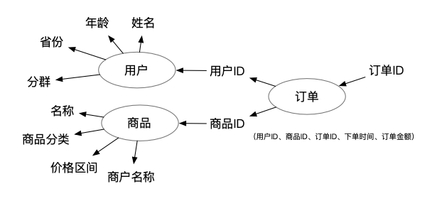

# 职业认知：工具型数据产品经理的独特价值观（1）

不管你是不是数据产品经理，你是否遇到过这样的情况：与需求方Battle一个业务需求时，明明打心里并不认同对方的说法，但又不知道从何反驳。

对方的说法似乎很有道理，但是自己心理又隐约觉得，照着对方的办法做下去，早晚会出问题。

在这种情况下，我们应该如何有理有据的说服对方呢？这里我们就来讲讲工具型数据产品经理看待问题的独特价值观。

这里要特别强调的是“工具型”。

正如前面所说的数据产品经理分类：如果是分析型，则更多需要从业务的角度考虑；而治理型虽然也要考虑业务问题，但与业务需求之间还是有一段距离。

只有工具型的数据产品经理，既要与使用工具的业务同学打交道，又要考虑工具的发展，更容易遇到上面描述的问题。

## 1）通用性与针对性

工具型的数据产品经理，需要更关注通用性。

这一点与To C的用户产品经理有相似的地方——我们都是从用户的需求中提炼共性，并根据共性需求设计产品；而对于差异的部分，采用尽量降低成本的方式满足。

对于To C的产品，基于算法实现“千人千面”就是个降低成本的办法；而对于数据产品，提供一个能编写SQL脚本的输入框，就是降低成本的办法。

比如有一次，当时我正在与另一个偏向业务的部门合作，做留存分析模块。

听到留存分析这个词，相信你已经知道我们的分析思路了——通过用户留存的情况和变化趋势，观察存量用户的结构，评估新增用户的质量，并圈定需要运营的目标用户群。

在这个案例中，我代表的是工具型数据产品经理，而另一方则代表分析型（或策略、算法等）的数据产品经理。我们要解决的共同问题，是用现有的数据实现留存分析；而分歧在于如何处理数据。

我的观点是 **通用性** 的：应当加工一张宽表。在宽表的设计中，尽量考虑将来兼容更多的业务和活动，这样就能保证表结构是相对稳定的。

这样做的优点就是：不论将来补充什么样的数据，都可以保证产品的交互功能设计以及数据查询逻辑大体不变。

为此付出的代价，就是在开始前需要多花些精力调研数据情况，并需要考虑包容不同的数据结构；同时为了保证通用性，还需要多计算和存储一些数据。换句话说，就是用更多的前期投入，来换取将来的稳定。

而对方的观点是 **针对性** 的：之前已经通过SQL语句脚本实现了留存数据的计算过程，只需要按照此前的SQL脚本来设计产品功能并查询数据就可以了。如果遇到了新的数据源，需要按照现有的SQL脚本上，修改后创建新脚本，再使用新脚本做分析。

这样做的优点是：能保证足够的灵活性，可以通过修改SQL脚本人工引入新的数据源、人工处理不同数据源的差异等等。

但这样做的风险也很明显：当接入的新数据的结构与以往不同时，由于人工处理不必考虑通用性，就要调整产品功能来应对不同的数据了。因此，这种方案相当于把工作量留给了未来，随时可能因为数据变化，而必须迭代上线。

这显然是两种不同的“价值观”了。

> **其实这两种思路的取舍不是现在才有的。早在RDBMS（关系型数据库管理系统）和数据仓库的设计中，就得到了体现。**

首先说RDBMS相关的“范式”，就是一些用来设计关系型数据库的指导性。发展到今天，从第一到第五共有5个用数字表示的范式，另有一个BC范式。而常说的“三大范式”，一般指的是第一、第二、第三范式。

为什么要有“范式”？在RDBMS的时代，计算机的存储很昂贵。当年的技术面试题，问的都是“如何在1 MB的内存空间中对超过1000万条数据进行排序”这样的问题。

而范式存在的重要目的就是减少数据冗余，数据库中尽量只存储必要的数据，减少存储空间的同时，从而也减少了每次数据计算需要处理的数据量。

这种优势在数据分析的场景下则 **完全不成立** 了，这也就导致了完全不同的处理方案。

说到数据分析，一定要说数据仓库和数据集市。这两个概念都是为了让数据分析的过程更加顺畅而产生的。

> **数据分析场景与业务应用场景的最大区别，就是数据分析需要考虑很多的维度。**

举一个例子：

用最简单的电商场景。用户下单买了一件商品。此时，我们在数据库里记录了这一笔订单的信息。

这个过程大概是：

1. 我们取得当前登录系统的用户是谁，尤其是要获得这问用户的ID。这个ID在系统里是唯一的。
2. 再获得用户购买的商品是哪个，同样需要获得商品的ID。一般会使用SKU或者SPU的唯一编码。
3. 创建订单记录，获得一个新的订单ID，并在这个订单ID上，记录下单的用户ID，记录购买的商品ID，同时记录下单时间、订单金额等其他属性。

一个极简版的用户下单过程，到此已经结束了。我们来看下，在这个过程中究竟发生了什么。

我们去获取用户的各种信息了吗？没有。那些信息，在用户登录我们的电商系统的时候，就已经读取并展示在页面上了

那我们去获取商品的各种信息了吗？也没有。商品的信息是在用户打开商品详情页或者进入订单确认页面的时候就已经读取出来了。

所以我们发现了，在这个极简版的用户下单过程中，对于用户我们只关心ID，对于商品我们同样只关心ID。

这样就减少了很多数据读取、计算和更新的损耗。

看起来是不是极其简单？简直完美~

但是问题来了，数据分析的过程可不是这样。

如果有一天，我们要反过来分析订单，其过程大致是这样的：

1. 首先，我们通过订单ID，查到订单的时间、金额这些信息，还要查出用户ID和商品ID；
2. 接下来，我们需要通过用户ID，查到用户的年龄、省份、所属分群等，这些是用户提供的分析维度；
3. 再用商品ID，查到商品的所属分类、价格区间、商户名称等信息，这些是商品提供的分析维度；
4. 最后，就是大家熟悉的“多维分析”的过程了。我们需要按照上面所有用户和商品的分析维度，计算订单的数量、订单金额等信息。

经过上面的讲解，如果我们依然遵守“精简”的数据库设计思路，那么在每次做分析的时候，我们都需要至少进行3个层次的关联查询（订单、用户、商品），才能覆盖所有我们要分析的数据。

这还只是一个“极简”的用户下单的场景。在实际中，还要加上促销策略、推荐策略、销售渠道、会员体系等等。

随着数据量越来越多，自然也就“查不动”了。

为了解决这样的问题，面向数分析的数据仓库，采取了完全相反的方案。

这里我们再来仔细考虑一下，是什么造成了上面这种多次关联查询呢？有两个主要原因：

1. 数据分析的场景与业务日常运转的场景不同，需要看更多的维度；
2. 很多维度分散在很多数据表甚至数据库当中，因此数据分析的时候

因此，设计数据仓库比较常用的是“星型模型”。星型模型中，区分了“事实表”和“维表”的概念。

在星型模型的指导下，我们使用的数据就变成了这样：

怎么样，是不是看到“星”了？

跟上图对比一下就很容易发现，这次我们再做分析的时候，几乎只用订单ID就能直接取到所有维度数据了。

大多数用户数据和商品数据，被“冗余”到了订单数据中，减少了做分析时的关联操作，从而用“冗余”提升了“分析性能”。

接下来还有两个很重要的问题：

> **这种“冗余”是否“必要”？以及如何在“通用性”与“针对性”之间做选择？**

先给结论：如果你所处的工作环境，数据越是混乱，越好坚持采取“通用性”。

相反，如果工作环境中的数据已经比较规整，只有少部分是例外情况，那么反而可以考虑接受需求方对灵活度的诉求。

这个“混乱”的判定标准是什么呢？这个需要从人和系统两方面综合评估。

这里我给出一个实战一点的判断方法：

比如某天，业务同学发现我们提供的指标发生波动了，并认为是数据问题或系统问题导致的，要求查看这个指标背后的数据加工逻辑是什么。

面对这样一个场景，在你工作的环境中是如何处理的？

> 回答1：“这个问题我先反馈一下，我们需要查询一下具体的计算过程有没有问题”。

这种回答说明你所处的环境数据还比较混乱，建议在职责范围内，坚持“局部通用性”。

> 回答2：“这个属于xxx类型的指标，来自xxx这个数据表。具体情况你可以问一下xxx，让TA帮你解决”。

这种回答说明你所处的环境属于中等，有些数据还可以，有些数据比较混乱。建议你对于比较混乱的那部分数据坚持“局部通用性”，对于比较标准的那部分数据，倒是可以考虑“针对性”。

> 回答3：“你自己去xxx系统里查”。

这种回答只能是两种情况，可能是系统不够完善但业务同学能力很强，也可能是业务同学水平一般但系统很完善。不管哪种情况，你都可以考虑使用“针对性”原则，去设计一些更好玩的东西了。